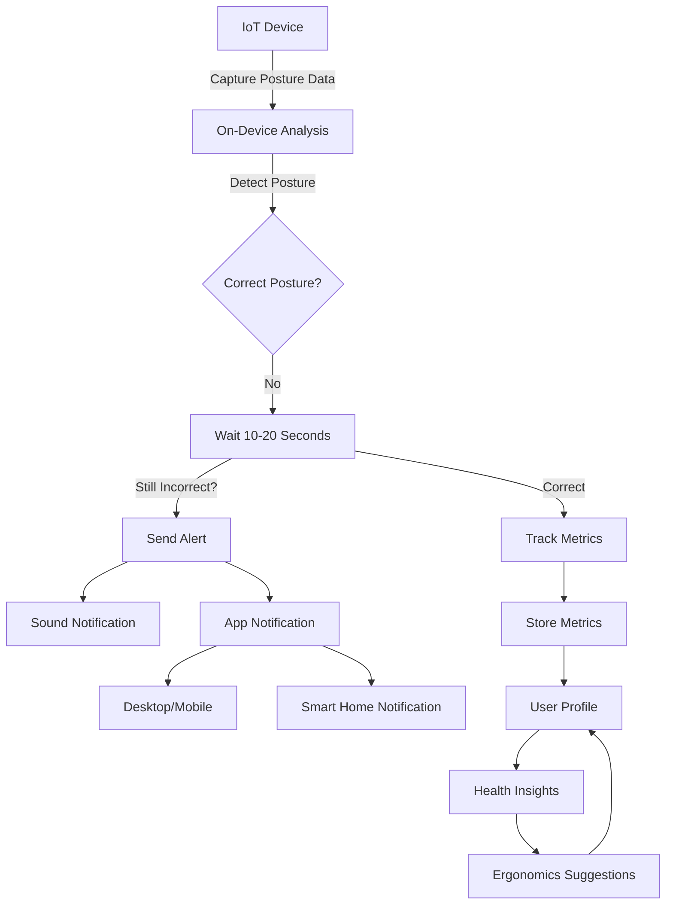

# AI-Based IoT Camera for Posture Correction

## Proposed Solution

### Explanation

This project involves the creation of a smart posture correction system comprising two components:

1. **Hardware/IoT Device**: An AI-powered camera system designed to monitor and analyze sitting posture.
2. **Companion App**: A mobile and desktop application for configuration, notifications, and metrics tracking.

### Addressing the Problem

Poor posture is a common issue leading to long-term health problems such as back pain, spinal misalignment, and reduced productivity. Existing solutions often compromise privacy by relying on cloud-based analysis or lack comprehensive features for health improvement.

### Innovation

This solution emphasizes privacy by performing on-device detection. It incorporates advanced posture tracking, health insights, and smart home integrations, creating a holistic system for improving ergonomics and back health.

---

## Technical Approach

### Tools/Frameworks Required

- **Hardware**:
  - Raspberry Pi 3 or similar for processing.
  - RGB and optional thermal cameras for detection.
  - Sound module for audio notifications.
  - Wi-Fi and Bluetooth modules for connectivity.
- **Software**:
  - MediaPipe or TensorFlow Lite for pose detection.
  - Flutter for cross-platform companion app development.
  - APIs for optional cloud storage and smart home integration.

### Blueprint/Architecture ([mermaid](https://mermaid.live/))

### Execution

- **Hardware Setup**:
  - Assemble the Raspberry Pi with the required cameras and sound module.
  - Configure Wi-Fi/Bluetooth for connectivity.
- **Software Development**:
  - Implement on-device posture detection using MediaPipe.
  - Develop a mechanism to delay notifications for 10-20 seconds to allow self-correction.
  - Develop the companion app for configuration, notifications, and health insights.
- **Integration**:
  - Enable smart home connectivity via webhooks and IFTTT.
  - Test the system for accuracy and usability.

---

## Feasibility & Viability

### Implementation Feasibility

- **Hardware**: Affordable and widely available components such as Raspberry Pi and cameras.
- **Software**: Leveraging existing frameworks like MediaPipe and Flutter simplifies development.

### Challenges & Solutions

- **Real-Time Performance**: Use optimized models and lower frame rates to ensure smooth processing.
- **Privacy Concerns**: Perform all analysis on-device to eliminate the need for cloud processing.
- **Delayed Notifications**: Implement a configurable delay (10-20 seconds) to allow for self-correction before sending alerts.
- **Multiple User Profiles**: Develop a robust profile management system to cater to different users.

---

## The Effect

### Target Impact

- **Improved Health**: Encourage better posture, reducing the risk of long-term back problems.
- **Enhanced Productivity**: Promote comfort during work or study sessions.
- **Awareness**: Provide users with detailed insights into their posture habits and trends.

### Influence

- **Household Adoption**: A multi-profile system makes it suitable for families.
- **Integration with Daily Life**: Compatibility with smart home systems ensures seamless usage.
- **Ergonomic Improvements**: Educates users on proper sitting posture and provides actionable recommendations.
