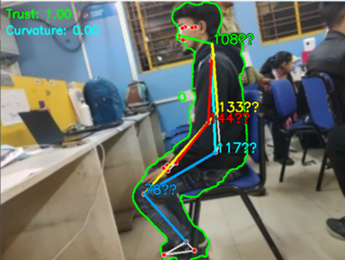

# Po-GO (Posture-good)

*partially complete*

Po-Go (Posture-good) is a machine learning-powered posture correction system designed for real-time ergonomic health monitoring with on-device ML processing, and Wi-Fi/Bluetooth connectivity. It operates without cloud dependency, ensuring faster, secure, and privacy-focused posture analysis.

Key features:  
- Intelligent posture detection using ML-based skeletal tracking for real-time corrections  
- Edge processing that eliminates cloud dependency for low-latency analysis  
- Multi-mode alerts with IoT speaker alerts and notifications 
- Seamless connectivity through Wi-Fi for remote tracking and Bluetooth for localized alerts 

Po-Go is not just a posture tracker, it is a next-generation digital wellness companion, engineered to prevent postural fatigue, musculoskeletal issues, and workplace discomfort.

## Proposed Solution

### Explanation

This project involves the creation of a smart posture correction system comprising two components:

1. **Hardware/IoT Device**: An AI-powered camera system designed to monitor and analyze sitting posture.
2. **Companion App**: A mobile and desktop application for configuration, notifications, and metrics tracking.

### Addressing the Problem

Poor posture is a common issue leading to long-term health problems such as back pain, spinal misalignment, and reduced productivity. Existing solutions often compromise privacy by relying on cloud-based analysis or lack comprehensive features for health improvement.

### Innovation

This solution emphasizes privacy by performing on-device detection. It incorporates advanced posture tracking, health insights, and smart home integrations, creating a holistic system for improving ergonomics and back health.

---

## Technical Approach

### Tools/Frameworks Required

- **Hardware**:
  - Raspberry Pi 3 or similar for processing.
  - RGB and optional thermal cameras for detection.
  - Sound module for audio notifications.
  - Wi-Fi and Bluetooth modules for connectivity.
- **Software**:
  - MediaPipe or TensorFlow Lite for pose detection.
  - Flutter for cross-platform companion app development.
  - APIs for optional cloud storage and smart home integration.

### Blueprint/Architecture ([mermaid](https://mermaid.live/))

### Execution

- **Hardware Setup**:
  - Assemble the Raspberry Pi with the required cameras and sound module.
  - Configure Wi-Fi/Bluetooth for connectivity.
- **Software Development**:
  - Implement on-device posture detection using MediaPipe.
  - Develop a mechanism to delay notifications for 10-20 seconds to allow self-correction.
  - Develop the companion app for configuration, notifications, and health insights.
- **Integration**:
  - Enable smart home connectivity via webhooks and IFTTT.
  - Test the system for accuracy and usability.

---

## Feasibility & Viability

### Implementation Feasibility

- **Hardware**: Affordable and widely available components such as Raspberry Pi and cameras.
- **Software**: Leveraging existing frameworks like MediaPipe and Flutter simplifies development.

### Challenges & Solutions

- **Real-Time Performance**: Use optimized models and lower frame rates to ensure smooth processing.
- **Privacy Concerns**: Perform all analysis on-device to eliminate the need for cloud processing.
- **Delayed Notifications**: Implement a configurable delay (10-20 seconds) to allow for self-correction before sending alerts.
- **Multiple User Profiles**: Develop a robust profile management system to cater to different users.

---

## The Effect

### Target Impact

- **Improved Health**: Encourage better posture, reducing the risk of long-term back problems.
- **Enhanced Productivity**: Promote comfort during work or study sessions.
- **Awareness**: Provide users with detailed insights into their posture habits and trends.

### Influence

- **Household Adoption**: A multi-profile system makes it suitable for families.
- **Integration with Daily Life**: Compatibility with smart home systems ensures seamless usage.
- **Ergonomic Improvements**: Educates users on proper sitting posture and provides actionable recommendations.

---

# Po-Go: AI-Powered Posture Monitoring System

## 1. How Po-Go is Different from Existing Solutions

We found two existing hardware based posture correction solutions:

1. *UprightPose* ([Website](https://www.uprightpose.com/)) - A necklace-type wearable that provides vibratory feedback for posture correction.
2. *ErgoTac* ([Paper](https://arxiv.org/abs/2204.13955)) - An exoskeleton-based wearable that delivers directional vibrations to assist with posture correction.

### Features That Make Posture-Good Superior
- *Optimal Price and Performance* - Exoskeletons are expensive, and necklace wearables lack full-body insights.
- *Non-Intrusive Solution* - Po-Go is a purely optical system without discomfort from wearables.
- *Enhanced Data Insights* - Provides deeper analysis than competitors.

### Po-Go: Non-Invasive, AI-Powered Solution
- Uses a *webcam and real-time AI analysis* for long-term posture tracking.
- No need for physical wearables, reducing discomfort.

## 2. Key Features of Po-Go

### Feature 1: Non-Invasive, AI-Based Posture Monitoring
- uses *AI-powered computer vision* via a webcam.
- Monitors full-body posture dynamically.

*Advantages:*
- No discomfort from wearables.
- Exoskeletons are costly and require training.
- Works seamlessly with any existing setup.

### Feature 2: Personalized Alerts & Long-Term Tracking
- Tracks posture trends over time with *weekly/monthly insights*.
- Provides *customized alerts* when bad posture persists.

*Advantages:*
- offers *long-term analytics*.
- Portable and compatible with any desk setup.

### Feature 3: Cost-Effective & Scalable for Any Workspace
- No need to buy expensive hardware—works with a standard *webcam and browser*.
- Highly scalable—suitable for offices, schools, and remote work setups.

*Advantages:*
- *Lower cost* than wearable devices ($100–$200).
- *More flexible* than AI-based ergonomic chairs.
- Scalable across environments without additional cost.

## 3. Smart Posture Detection Using RGB & Thermal Cameras

### Technologies Used:
- *MediaPipe Pose Estimation (TensorFlow Lite)* for real-time human pose estimation.
- *RGB Cameras (webcams, IP cameras)* for input.
- *Thermal Cameras (optional)* for temperature-based posture analysis.
- *Edge Processing* using AI accelerators for real-time performance.

### Step-by-Step Process
1. *Capture Input*: RGB/thermal cameras detect body key points.

2. *Real-Time Pose Estimation*: AI detects key landmarks like spine alignment, shoulder position, and back curvature.
<table>
  <tr>
    <td></td>
    <td></td>
    <td></td>
  </tr>
</table>
3. *Posture Classification: Uses **ISO 11226 & EN 1005-4 standards*.

 
4. *Posture Alerts & Feedback*:
   - Alerts triggered if bad posture persists for *20+ minutes*.
   - *Notifications, posture logs, and AI-based ergonomic advice* provided.

## 4. Eliminating Cloud Dependency with On-Device AI

Po-Go operates *without cloud processing* for *privacy, real-time performance, and lower latency*.

### How It Works
- *On-device AI processing* using *MediaPipe, OpenCV, TensorFlow Lite*.
- *No personal data is stored or transmitted*—only posture analysis results are sent to the server in JSON format.
- *Secure string-based data communication* ensures privacy.

## 5. Security & Privacy Features

### Key Security Measures
| Security Feature         | Po-Go’s Approach                           | Benefit                                  |
|-------------------------|---------------------------------|--------------------------------|
| *On-Device AI*        | Runs locally on device          | Prevents cloud-based data leaks |
| *Encrypted Communication* | SSL/TLS encryption               | Prevents MITM attacks         |
| *Authentication & Access Control* | JWT, RBAC, MFA                  | Ensures secure user access     |
| *Minimal Data Storage* | No PII, anonymized logging      | Eliminates data breach risks   |
| *Secure Firmware Updates* | OTA updates with signature verification | Protects against malware       |

## 6. Machine Learning Model & Data

### Training & Testing Dataset
- Uses *MediaPipe Pose, which infers **33 3D landmarks* from RGB video frames.
- Evaluated using *Yoga, Dance, and HIIT datasets*.

### Feature Matrix
- *Landmarks tracked:* shoulders, elbows, wrists, hips, knees, ankles.
- Uses a *detector-tracker model* inspired by BlazePose GHUM 3D.

### Accuracy Considerations
- *Best accuracy with direct camera angles.*
- *3D pose RMSE:* ~30mm with stereo cameras.

## 7. Bluetooth-Based Alert System (Concept)

### Alert Methods
1. *BLE Connection to Wearable Device*
   - Uses *HC-05/HM-10 BLE modules* to send vibration alerts.
2. *Audio-Visual Alerts*
   - *Speakers & LED indicators* signal posture deviations.

## 8. Comparison: Po-Go vs. Other Posture Solutions

| Feature                  | Po-Go (Posture Good) | Wearables (e.g., Upright GO 2) | Haptic Feedback (DVFI) |
|-------------------------|------------------|-----------------|----------------|
| *Hardware*            | None (Uses webcam) | Requires a wearable | Multiple sensors needed |
| *User Comfort*        | Non-intrusive | Potentially uncomfortable | Bulky |
| *Cost*                | Low (software-based) | High (device & adhesives) | Expensive |
| *Data Analytics*      | AI-driven insights | Limited real-time feedback | Limited feedback |
| *Customization*       | Adaptive learning | Fixed sensitivity | Standardized feedback |
| *Setup*              | Easy | Complex (device pairing) | Complex (sensor alignment) |
| *Environmental Impact* | Eco-friendly | Adhesives & device waste | Multiple components & batteries |

### Why Po-Go is the Best Choice
1. *More Affordable & Accessible*: Eliminates extra costs by using webcams and AI software.
2. *No Wearables = More Comfort*: No irritation or bulky accessories.
3. *Advanced AI & Analytics*: Offers real-time tracking and insights.
4. *Eco-Friendly & Low Maintenance*: No batteries, replacements, or recalibration required.
5. *Easy Setup & Universal Compatibility*: Works with any laptop, PC, or smartphone with a webcam.

## Conclusion
By offering an *AI-powered, non-invasive, cost-effective, and scalable* posture monitoring solution, Po-Go surpasses traditional wearable and hardware-based alternatives. It ensures *long-term health benefits* through real-time tracking, adaptive AI alerts, and seamless integration with everyday workspaces.

