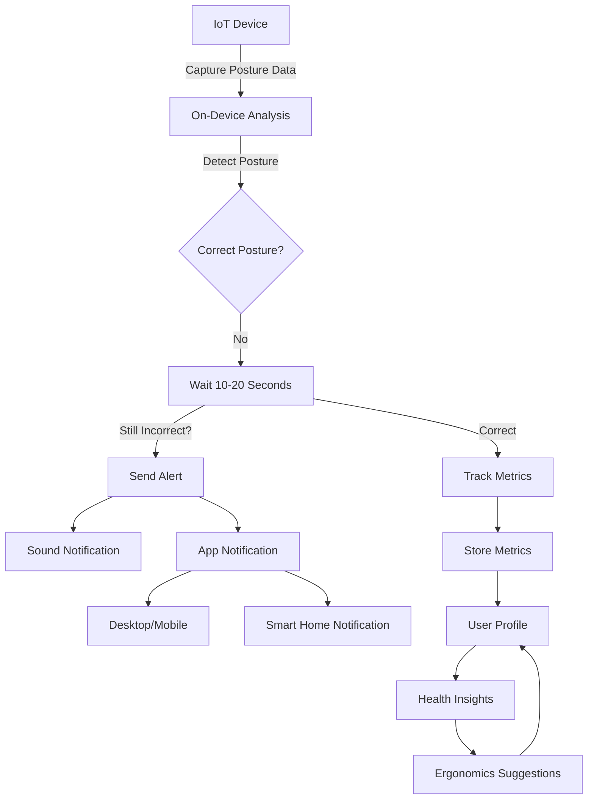
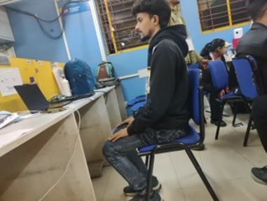
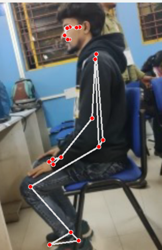
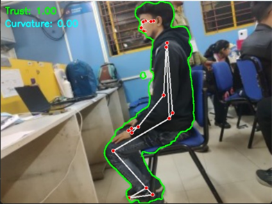
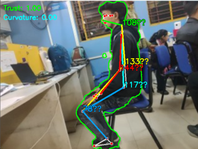

# Po-GO (Posture-Good)

**Po-GO (Posture-Good)** is a machine learning-powered posture correction system designed for real-time ergonomic health monitoring with on-device ML processing and Wi-Fi/Bluetooth connectivity. It operates without cloud dependency, ensuring faster, secure, and privacy-focused posture analysis.

**Key Features:**

- **Intelligent Posture Detection:** ML-based skeletal tracking for real-time corrections.
- **Edge Processing:** Eliminates cloud dependency for low-latency analysis.
- **Multi-Mode Alerts:** IoT speaker alerts and notifications.
- **Seamless Connectivity:** Wi-Fi for remote tracking and Bluetooth for localized alerts.

Po-GO is more than just a posture tracker; it is a next-generation digital wellness companion engineered to prevent postural fatigue, musculoskeletal issues, and workplace discomfort.

---

## Proposed Solution

### Overview

This project comprises two main components:

1. **Hardware/IoT Device:** An AI-powered camera system designed to monitor and analyze sitting posture.
2. **Companion App:** A mobile and desktop application for configuration, notifications, and metrics tracking.

### Addressing the Problem

Poor posture can lead to long-term health issues such as back pain, spinal misalignment, and reduced productivity. Many existing solutions compromise privacy by relying on cloud-based analysis or lack comprehensive features for health improvement. Po-GO solves these issues by performing on-device analysis and offering a holistic health monitoring system.

### Innovation

- **Privacy-Focused:** All processing is performed on-device.
- **Advanced Posture Tracking:** Provides real-time corrections and health insights.
- **Smart Home Integration:** Connects seamlessly with smart home systems for an enhanced user experience.

---

## Technical Approach

### Tools and Frameworks

#### Hardware:

- **Processing Unit:** Raspberry Pi 3 or similar.
- **Cameras:** RGB and optional thermal cameras.
- **Audio:** Sound module for audio notifications.
- **Connectivity:** Wi-Fi and Bluetooth modules.

#### Software:

- **Pose Detection:** MediaPipe or TensorFlow Lite.
- **App Development:** Flutter for cross-platform applications.
- **APIs:** For optional cloud storage and smart home integration.

### System Architecture

### Execution Steps

1. **Hardware Setup:**
   - Assemble the Raspberry Pi with the cameras and sound module.
   - Configure Wi-Fi and Bluetooth connectivity.
2. **Software Development:**
   - Implement on-device posture detection using MediaPipe.
   - Integrate a configurable delay (10–20 seconds) to allow for self-correction before alerting.
   - Develop the companion app for configuration, notifications, and health insights.
3. **Integration:**
   - Enable smart home connectivity via webhooks and IFTTT.
   - Conduct thorough testing for accuracy and usability.

---

## Feasibility & Viability

### Implementation Feasibility

- **Hardware:** Uses affordable and widely available components.
- **Software:** Leverages existing frameworks like MediaPipe and Flutter.

### Challenges & Mitigation

- **Real-Time Performance:** Optimize models and use lower frame rates.
- **Privacy Concerns:** All processing is on-device, eliminating cloud dependency.
- **Notification Delay:** Configurable delay allows self-correction before alerts.
- **Multiple User Profiles:** Develop a robust profile management system.

---

## Impact

### Target Impact

- **Improved Health:** Encourages better posture and reduces long-term back problems.
- **Enhanced Productivity:** Promotes comfort during work or study.
- **User Awareness:** Provides detailed insights into posture habits and trends.

### Broader Influence

- **Household Adoption:** Multi-profile support makes it suitable for families.
- **Daily Integration:** Compatible with smart home systems for seamless usage.
- **Ergonomic Education:** Offers actionable recommendations for improved posture.

---

# Po-GO: AI-Powered Posture Monitoring System

## 1. How Po-GO Stands Out

Existing hardware-based posture solutions include:

- **UprightPose:** A necklace-type wearable providing vibratory feedback.
- **ErgoTac:** An exoskeleton-based wearable delivering directional vibrations.

### Advantages of Po-GO:

- **Optimal Price and Performance:** More cost-effective than exoskeletons and offers full-body insights compared to necklace wearables.
- **Non-Intrusive:** A purely optical system that avoids the discomfort of wearables.
- **Enhanced Data Insights:** Provides deeper analysis and comprehensive posture tracking.

---

## 2. Key Features

### Feature 1: Non-Invasive, AI-Based Posture Monitoring

- **Technology:** Utilizes AI-powered computer vision via a webcam.
- **Benefits:**
  - No discomfort from wearables.
  - Superior full-body posture tracking.

### Feature 2: Personalized Alerts & Long-Term Tracking

- **Functionality:** Tracks posture trends over time with weekly/monthly insights.
- **Benefits:**
  - Provides customized alerts when poor posture persists.
  - Offers long-term analytics for improved health insights.

### Feature 3: Cost-Effective & Scalable

- **Deployment:** Works with a standard webcam and browser.
- **Benefits:**
  - Lower cost compared to wearable devices.
  - Scalable across offices, schools, and remote work setups.

---

## 3. Smart Posture Detection Using RGB & Thermal Cameras

### Technologies Employed:

- **Pose Estimation:** MediaPipe Pose Estimation (TensorFlow Lite) for real-time analysis.
- **Camera Inputs:** RGB cameras (webcams, IP cameras) and optional thermal cameras.
- **Edge Processing:** Utilizes AI accelerators for enhanced performance.

### Process Overview

1. **Capture Input:**  
   RGB/thermal cameras detect body keypoints.
   

2. **Real-Time Pose Estimation:**  
   AI detects key landmarks like spine alignment and shoulder position.

   <table>
     <tr>
       <td></td>
       <td></td>
       <td></td>
     </tr>
   </table>

3. **Posture Classification:**  
   Utilizes **ISO 11226 & EN 1005-4 standards**.

4. **Alerts & Feedback:**
   - Alerts trigger if poor posture persists for 20+ minutes.
   - Provides notifications, posture logs, and AI-based ergonomic advice.

---

## 4. On-Device AI Processing

Po-GO ensures privacy and low latency by eliminating cloud dependency.

### How It Works:

- **Local Processing:** Uses MediaPipe, OpenCV, and TensorFlow Lite.
- **Data Security:** Only posture analysis results (in JSON format) are transmitted.
- **Communication:** Secure string-based data communication.

---

## 5. Security & Privacy

| **Security Feature**                | **Po-GO’s Approach**                    | **Benefit**                     |
| ----------------------------------- | --------------------------------------- | ------------------------------- |
| **On-Device AI**                    | Processes data locally                  | Prevents cloud-based data leaks |
| **Encrypted Communication**         | SSL/TLS encryption                      | Mitigates MITM attacks          |
| **Authentication & Access Control** | JWT, RBAC, MFA                          | Ensures secure user access      |
| **Minimal Data Storage**            | No PII; anonymized logging              | Reduces data breach risks       |
| **Secure Firmware Updates**         | OTA updates with signature verification | Protects against malware        |

---

## 6. Machine Learning Model & Data

### Training & Testing

- **Model:** Uses MediaPipe Pose to infer **33 3D landmarks** from RGB video frames.
- **Datasets:** Evaluated using Yoga, Dance, and HIIT datasets.

### Feature Matrix

- **Tracked Landmarks:** Shoulders, elbows, wrists, hips, knees, ankles.
- **Model Inspiration:** Detector-tracker model inspired by BlazePose GHUM 3D.
- **Accuracy:** ~30mm RMSE with stereo cameras under optimal conditions.

---

## 7. Bluetooth-Based Alert System (Concept)

### Alert Methods:

1. **BLE Alerts:**
   - Utilizes HC-05/HM-10 BLE modules to send vibration alerts.
2. **Audio-Visual Alerts:**
   - Uses speakers and LED indicators to signal posture deviations.

---

## 8. Comparison: Po-GO vs. Other Solutions

| **Feature**              | **Po-GO (Posture-Good)**      | **Wearables (e.g., Upright GO 2)** | **Haptic Feedback (DVFI)**      |
| ------------------------ | ----------------------------- | ---------------------------------- | ------------------------------- |
| **Hardware**             | Uses webcam; no extra devices | Requires a wearable device         | Multiple sensors needed         |
| **User Comfort**         | Non-intrusive                 | May cause discomfort               | Bulky and intrusive             |
| **Cost**                 | Low (software-based)          | High (device and accessories)      | Expensive                       |
| **Data Analytics**       | Advanced AI-driven insights   | Limited real-time feedback         | Limited feedback                |
| **Customization**        | Adaptive learning             | Fixed sensitivity                  | Standardized feedback           |
| **Setup**                | Easy integration              | Complex device pairing             | Complex sensor alignment        |
| **Environmental Impact** | Eco-friendly                  | Uses disposable adhesives          | Multiple components & batteries |

### Why Po-GO is the Best Choice

- **Affordable & Accessible:** Leverages common webcams and AI software to reduce costs.
- **Comfort:** No wearables means no irritation or bulky devices.
- **Advanced Analytics:** Offers real-time tracking and detailed insights.
- **Eco-Friendly:** Minimal maintenance with reduced environmental impact.
- **Universal Compatibility:** Easily integrates with any laptop, PC, or smartphone with a webcam.

---

## Conclusion

Po-GO offers an **AI-powered, non-invasive, cost-effective, and scalable** posture monitoring solution that outperforms traditional wearable and hardware-based alternatives. It ensures long-term health benefits through:

- Real-time tracking and adaptive AI alerts.
- Detailed ergonomic recommendations.
- Seamless integration with everyday workspaces.

By choosing Po-GO, users gain an innovative digital wellness companion dedicated to improving posture, enhancing productivity, and safeguarding long-term health.
